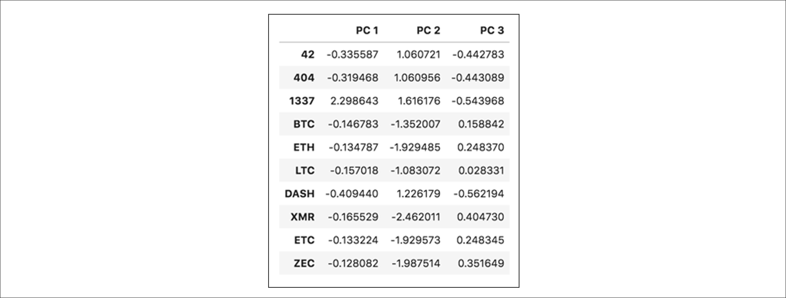

# Cryptocurrencies

## Background

In this project, I created a report that includes what cryptocurrencies are on the trading market and how they could be grouped to create a classification system for a new investment. The data was cprocessed to fit the machine learning models. Since there is no known output, I used unsupervised learning. To group the cryptocurrencies, I chose a clustering algorithm. Finally, I used data visualizations to share findings.

### Deliverable 1
Preprocessed the data into a clean dataframe for Principal Component Analysis (PCA).

### Deliverable 2
Used PCA to reduce the dimensions of the DataFrame to three principal components and placed these dimensions in a new DataFrame.

### Deliverable 3 & 4
Clustered Cryptocurrencies Using K-means. First I created an elbow curve using hvPlot to find the best value for K using the DataFrame from Deliverable 2. Then I ran the K-means algorithm to predict the K clusters for the cryptocurrencies’ data. Finally, I visualized the distinct groups that correspond to the three principal components and created a table with all the currently tradable cryptocurrencies using the hvplot.table() function.

